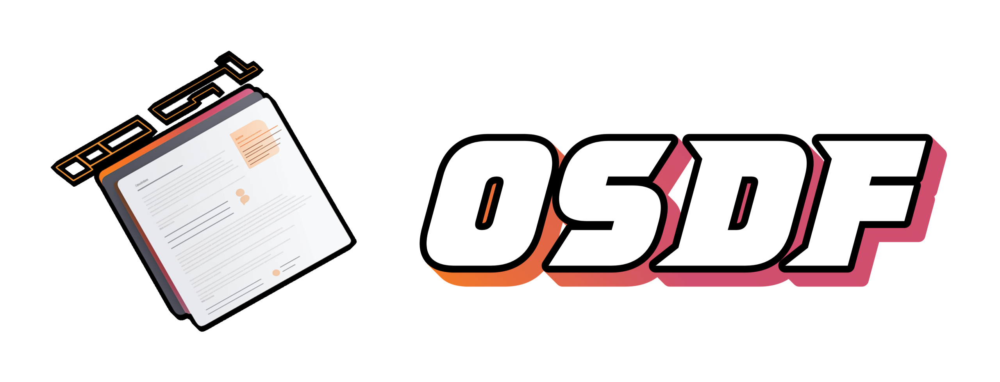
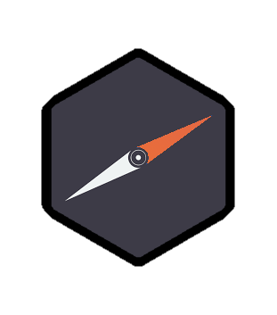
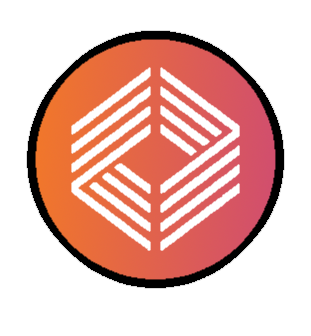

# OneScript Declarative Forms

**Декларативные формы для сценарного языка OneScript**

Данная библиотека позволяет создавать приложения с графическим интерфейсом (GUI), используя OneScript в качестве языка разработки. Она обеспечивает выполнение обработчиков событий и связь OS-сценария с окном программы на основе библиотеки [OneScriptClientServer ](https://github.com/ahyahy/OneScriptClientServer)


## Особенности



+ Для отрисовки интерфейса и элементов управления используется [nw.js](https://github.com/nwjs/nw.js) - кросплатформенный JavaScript-фреймворк, позволяющий создавать десктопные приложения на основе web-технологий. Благодаря ему готовое приложение может быть запущено на любой из основных операционных систем без внесения изменений в код

  >Изучать nw.js для использования библиотеки не нужно: механизм работы и взаимодействия со сценарием скрыт внутри библиотеки декларативных форм.



<br>

+ Логика приложения описывается на языкe 1С при помощи [OneScript](https://github.com/EvilBeaver/OneScript) - независимой кросс-платформенной реализации виртуальной машины, исполняющей скрипты на языке 1С:Предприятие. Интерфейс программы создается в декларативной парадигме, что позволяет работать в привычных терминах языка, не прибегая к прямой работе с HTML и JS

 <br>

 **Пример создания элемента интерфейса**
 ```bsl

	Кнопка1 = ДФ.Кнопка();
	Кнопка1.Родитель = Форма1;
	Кнопка1.Текст    = "Кнопка";
	Кнопка1.Нажатие  = ДФ.Действие(ЭтотОбъект, "Кнопка1_Нажатие");
 ```

<br> 

## Установка

Для начала работы необходимо:
1. Устанавить OneScript ([оф. сайт](https://oscript.io/))
2. Скачать и распаковать nw.js (версия >= v0.45.6, [оф. сайт](https://nwjs.io/))
3. Прочитать указанный ниже раздел документации и согласно этой информации организовать каталог будущей программы

## Документация

Документацию библиотеки можно найти [по этой ссылке](https://ahyahy.github.io/OneScriptDeclarativeForms/index.html)

>**ВАЖНО:** В разделе "Документация" кликните самый верхний пункт "Декларативные формы". Это нужно прочитать в первую очередь.


## Roadmap

Сейчас есть работающий движок, обработка событий, получение аргументов событий. В планах улучшение работы с таблицами.
